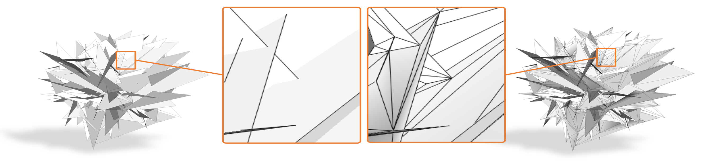

# Fast and Robust Mesh Arrangements using Floating-point Arithmetic

This is the code we used for the experiments in the paper "**Fast and Robust Mesh Arrangements using Floating-point Arithmetic**" by G. Cherchi, M. Livesu, R. Scateni and M. Attene (ACM TOG, SIGGRAPH Asia 2020). 

<p align="center"></p>

|:warning: WARNING: We are rewriting portions of the code to be more efficient. The code is therefore subject to continuous updates. We are also preparing an easy to use header-only version of our algorithm. It will be released as soon as possible.  |
| --- |

## Usage
Clone this repository, including submodules, with:
```
git clone --recursive https://github.com/gcherchi/FastAndRobustMeshArrangements.git
```
Once done, you may build the executable as follows:
```
mkdir build
cd build
cmake ..
```
This will produce an appropriate building configuration for your system.
On Windows MSVC, this will produce a mesh_arrangement.sln file.
On Linux/OSx, this will produce a Makefile. 
Use it as usual to compile mesh_arrangement.

|:warning: WARNING: Apparently, CLANG does not support a fully IEEE compliant floating point environment. The only way we found to guarantee correctness on this compiler was to disable all optimizations. Please be aware of this fact should you notice a performance degradation in your experiments. |
| --- |

Alternatively, you may build mesh_arrangement using the Qt project included: please, check **flags** and **includes** in the .pro file if you want to use a different tool.
You need to replace the `[TMesh_Kernel path]` with the path in your computer.
In the main.cpp file a single function `solveIntersections(...)` is called. It contains the entire pipeline.

We tested this code on MacOS and Linux (we are still testing on Windows).

## Citing us
If you use our code in your academic projects, please cite our paper using the following BibTeX entry:
```
@article{CLSA20,
  title   = {Fast and Robust Mesh Arrangements using Floating-point Arithmetic},
  author  = {Cherchi, Gianmarco and Livesu, Marco and Scateni, Riccardo and Attene, Marco},
  journal = {ACM Transactions on Graphics (SIGGRAPH Asia 2020)},
  year    = {2020},
  volume  = {39},
  number  = {6},
  doi     = {10.1145/3414685.3417818}
}
```


